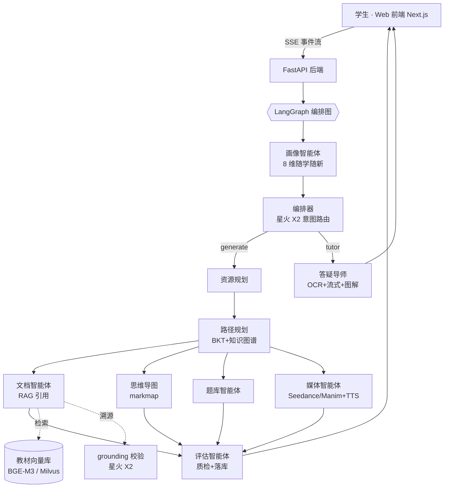

# SparkLearn 星火学伴 · 基于讯飞星火的多智能体个性化学习系统

第十五届"中国软件杯"大学生软件设计大赛 **A3 赛题**参赛作品。
面向《数据结构与算法》课程,以 **LangGraph 编排的 9 智能体 + 1 编排器**为核心,
实现"**对话建画像 → 规划学习路径 → 并行生成多模态资源 → 引用溯源防幻觉 → 答题评估闭环**"的完整个性化学习系统。

## 一图看懂架构



## 核心特性

1. **多智能体 DAG 编排**:LangGraph 条件路由 + 四资源节点真并行 fan-out/fan-in;前端 AgentTrace 遥测面板实时点亮每个智能体,过程全透明。
2. **8 维动态学生画像**:掌握度(BKT)、认知风格、易错点、目标、节奏、难度偏好、资源偏好、元认知;每次对话与答题"随学随新"。
3. **个性化路径规划**:课程知识图谱(16 节点 19 先修边)拓扑排序 + 掌握度阈值解锁 + 难度偏好打分,答题后自动重排。
4. **引用溯源防幻觉双层校验**:RAG 检索教材语料,正文 [^n] 脚注;星火 X2 做"答案-证据一致性"判定 + 本地敏感词/讯飞内容审核。
5. **多模态资源**:图文教程、交互脑图、智能题组、代码示例、讲解视频(火山 Seedance 文生视频,失败自动降级 Manim 动画代码 + 讯飞 TTS 旁白)。
6. **学习闭环**:答题 → BKT 更新掌握度 → 错因标签回写画像 → 路径重排 → 评估报告。
7. **离线演示模式**:不配任何密钥也能完整跑通五大功能(MockEngine 模拟流式输出,内容标注演示数据),评委一键体验。

## 快速开始

### 方式一:Docker 一键部署(推荐)

```bash
cp .env.example .env        # 按需填写讯飞/火山密钥;留空 = 离线演示模式
docker compose up -d --build
# 前端 http://localhost:3000   后端文档 http://localhost:8000/docs
# 如需 Milvus 向量库:docker compose --profile vector up -d
```

### 方式二:本地开发

```bash
# 后端
cd backend
pip install -r requirements.txt
uvicorn app.main:app --reload --port 8000

# 前端(另开终端)
cd frontend
npm install
npm run dev                 # http://localhost:3000
```

### 跑测试

```bash
cd backend
python tests/test_services.py      # 服务层:BKT / 知识图谱 / 路径规划
python tests/test_e2e_graph.py     # 端到端:生成 / 答疑 / 评估三链路(演示模式)
# 或安装 pytest 后:pytest tests -q
```

## 目录结构(摘要)

```
├── backend/                 FastAPI + LangGraph 多智能体后端
│   ├── app/agents/          10 个智能体 + 编排图 graph.py + 事件总线
│   ├── app/rag/             语料切片 / 三级降级 Embedding / 向量库 / 检索引用
│   ├── app/safety/          grounding 一致性校验 + 内容安全过滤
│   ├── app/services/        BKT / 知识图谱 / 画像 / 路径规划
│   ├── app/llm/             星火统一封装 / TTS / 文生图 / OCR / Seedance
│   ├── app/api/             SSE 接口层(chat / resources / path / tutor / eval)
│   └── app/data/            知识图谱 + 10 篇种子讲义 + 24 题种子题库
├── frontend/                Next.js 14 前端(深空蓝黑 · AgentTrace 遥测面板)
├── docs/                    五份赛事文档(开发/测试/环境/教程/代码结构)
└── docker-compose.yml       一键部署编排
```

## 文档索引

| 文档 | 说明 |
| --- | --- |
| [docs/开发说明书.md](docs/开发说明书.md) | 需求分析 · 系统设计 · 技术实现 · 创新点 |
| [docs/测试说明书.md](docs/测试说明书.md) | 功能/集成/性能/防幻觉测试用例与结果 |
| [docs/环境搭建指南.md](docs/环境搭建指南.md) | 密钥申请 · 依赖安装 · 部署与排错 |
| [docs/使用教程.md](docs/使用教程.md) | 五大功能完整操作流程(配截图位) |
| [docs/代码结构说明.md](docs/代码结构说明.md) | 模块职责 · 扩展指南 · 开源组件清单 |

## 致谢与声明

- 大模型能力由 **讯飞星火**(4.0 Ultra / X 深度推理 / Lite)与 **火山方舟 Seedance** 提供。
- 开发过程使用 AI 辅助编码工具(讯飞 iFlyCode 等),最终代码经人工审查与测试。
- 开源组件许可清单见 [docs/代码结构说明.md](docs/代码结构说明.md)。
