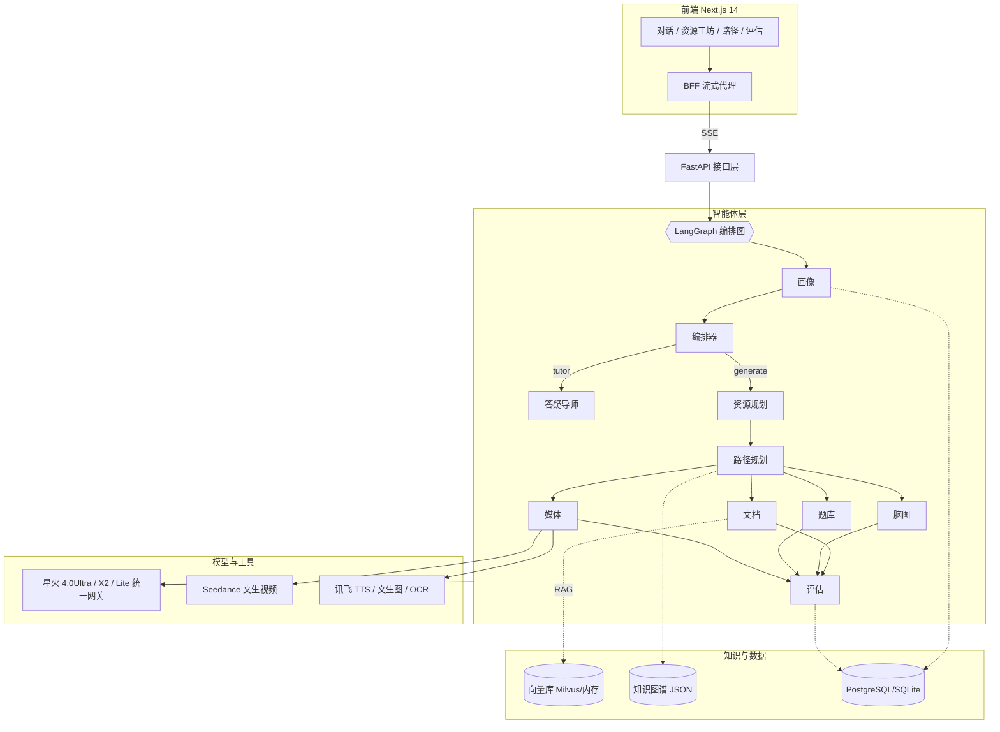

# SparkLearn 星火学伴 · 开发说明书

第十五届"中国软件杯"大学生软件设计大赛 A3 赛题
《基于讯飞星火的个性化资源生成与学习多智能体系统》

---

## 1 需求分析

### 1.1 赛题要求与课程选择

赛题要求构建一个面向真实课程的多智能体学习系统,具备学生画像、资源生成、路径规划、智能答疑与学习评估能力,并以讯飞星火大模型为核心底座。本作品选择《数据结构与算法》作为目标课程:它是计算机类专业的核心必修课,知识点先修关系清晰(天然适合知识图谱与路径规划),且包含代码、图示、推导等多种表达形态(天然适合多模态资源生成),同时学生普遍存在"听懂了不会做、会做了讲不清"的个性化辅导刚需。

### 1.2 用户画像与场景

系统的核心用户是修读该课程的本科生。典型场景包括:期末备考的学生用一句话说明目标与时间,系统给出按其薄弱点排序的复习路径与配套资源;遇到不会的题,拍照上传由答疑导师逐步点拨;做完一组题后,系统更新其掌握度并自动调整后续学习计划。次要用户是课程教师,可通过维护知识图谱与教材语料间接影响系统的出题与讲解口径。

### 1.3 功能需求

系统需要实现五大功能闭环。其一,学生画像:从对话与行为中持续抽取并更新不少于六个维度的画像。其二,个性化资源生成:按画像与知识点并行产出图文教程、思维导图、习题、代码示例与讲解视频等多模态资源,且内容可溯源到教材。其三,学习路径规划:基于课程知识图谱与掌握度给出"先学什么、为什么"的路径,并能随评估结果重排。其四,智能答疑:支持文本与拍照搜题的多模态输入,流式输出启发式讲解并附图解。其五,学习评估:答题后即时判分、更新掌握度、归因错误并反馈给画像与路径,形成闭环。

### 1.4 非功能需求

可演示性方面,系统在不配置任何密钥时必须仍可完整跑通五大功能(离线演示模式),避免比赛现场网络或配额问题导致演示失败。可靠性方面,外部服务(大模型、视频生成、向量库、TTS)任一不可用都不能让系统崩溃,而应逐级降级。可解释性方面,多智能体的协同过程要对用户实时可见。性能方面,对话类请求要求首 token 在 2 秒内返回(流式),全资源生成在并行加持下控制在分钟级。

## 2 总体设计

### 2.1 系统架构

系统采用"前端 Next.js + 后端 FastAPI + LangGraph 多智能体编排 + 星火大模型族 + 检索增强知识库"的分层架构。前端通过 BFF 代理与后端以 SSE 事件流通信;后端把每一次请求交给 LangGraph 编排图执行;图内十个智能体各司其职,经统一的 LLM 网关访问讯飞星火不同档位模型;知识层由教材语料向量库、课程知识图谱和关系型数据库(画像、资源、路径、事件)构成。

### 2.2 多智能体编排设计

编排图以 LangGraph `StateGraph` 实现,拓扑为:START → 画像 → 编排器 →(条件边)→ {生成分支:规划 → 路径 → 文档‖脑图‖题库‖媒体 → 评估;答疑分支:导师} → END。条件边由编排器调用星火 X2 深度推理模型做意图识别后给出,意图集合为 generate、tutor、eval、chat。四个资源节点是真正的并行 fan-out:LangGraph 自动并发执行,各节点对共享 State 的写入通过 `Annotated` reducer 合并(资源字典做并集、列表做追加),评估节点作为 fan-in 等待全部完成后做汇总质检。为保证在未安装 LangGraph 的极端环境仍可运行,内置了语义等价的 MiniGraph(基于 `asyncio.gather` 的并行与相同 reducer 规则),由 `build_graph()` 自动选择。

### 2.3 全局 State 与事件协议

State 是一个 `TypedDict`,关键字段包括 user_id、messages、intent、student_profile、plan、path_plan、generated_resources、citations、safety_flags 等。并行节点可能同时写入的字段全部带 reducer 注解,保证无锁合并的确定性。

智能体与前端之间的实时通信走"事件总线 + SSE":每个请求创建一个 `asyncio.Queue`,通过 `contextvars` 把发射函数注入当前请求上下文(刻意不放进 State,以保证 State 可被 LangGraph checkpointer 序列化)。事件类型共 13 种:agent_start、agent_end、agent_token、token、resource、profile、path、progress、citations、safety、summary、error、done。前端 AgentTrace 面板正是消费 agent_start/agent_end/progress 三类事件实时点亮编排 DAG。

### 2.4 数据模型

关系库含六张表:users、profiles(JSON 整体存取的八维画像 + 版本号)、resources(生成产物,payload 与 citations 为 JSON 列)、path_plans、event_logs(学习行为流水)、quiz_attempts(整卷一条,score + detail)。默认 SQLite 零依赖运行,docker-compose 注入 PostgreSQL。向量库默认进程内存实现(numpy 余弦 + JSON 持久化),配置 MILVUS_URI 后切换 Milvus。

## 3 详细设计与关键技术实现

### 3.1 大模型接入(讯飞星火)

全项目只通过 `llm_complete()` 与 `llm_stream()` 两个函数访问大模型(OpenAI 兼容接口,Bearer APIPassword 鉴权)。角色到模型的映射为:ultra→4.0Ultra(主力生成),reasoner→spark-x(X2 深度推理,走独立 base_url,用于意图识别、路径推理与 grounding 校验),lite→lite(免费档,承担画像抽取、打标签等高频低算力任务以控制成本)。当某档位限流或故障时按 ultra→max→pro→lite 顺序自动互备。TTS、文生图、OCR 走讯飞三元组 HMAC-SHA256 签名的 WebSocket/HTTP 旧鉴权,签名逻辑集中在 `signing.py`。

### 3.2 八维学生画像与"随学随新"

画像八个维度为:knowledge_mastery(逐知识点 0~1)、cognitive_style、error_prone、goal、pace、difficulty_pref、resource_pref、metacognition,超出赛题"不少于六维"的要求。画像智能体在每轮对话开始时用 Lite 模型从用户话语中抽取增量补丁(只输出有证据的字段),与库中画像深合并并使版本号自增;答题评估则通过 BKT 直接更新 knowledge_mastery,错因标签累积进 error_prone。前端画像雷达订阅 profile 事件,实现"边聊边变"的可视化。

掌握度更新采用标准贝叶斯知识追踪(BKT):先验 P(L)=0.30,学习率 P(T)=0.20,失误率 P(S)=0.10,猜测率 P(G)=0.20。答对时后验 P(L|correct)=P(L)(1−P(S)) / [P(L)(1−P(S))+(1−P(L))P(G)],答错时对称取反,再叠加学习转移 P(L') = P(L|obs) + (1−P(L|obs))·P(T)。该模型对"连对快速收敛、偶错温和回落"的行为刻画与教学直觉一致,实测连续答对两题掌握度即从 0.30 升过 0.80 阈值。

### 3.3 知识图谱与路径规划

课程知识图谱含 16 个知识点节点与 19 条先修边(复杂度→数组→……→动态规划),由教研侧以 JSON 维护。路径规划首先做 Kahn 拓扑排序(同层按难度升序),然后给每个节点定状态:掌握度 ≥0.8 记 done,全部先修 ≥0.6 记 ready,否则 locked;再对 ready 节点打分排序:score = (1−掌握度) + 0.5·命中目标 + 0.3·命中易错 + 难度偏好项(循序渐进 −0.06·难度,挑战式 +0.04·难度),得分最高者即"下一步推荐"。每个节点同时生成自然语言"处方"解释推荐理由,满足可解释性要求。

### 3.4 RAG 检索增强与引用溯源

教材语料以带 front matter(source/chapter/kp/license)的 Markdown 维护,入库时按二级标题切大段、代码块整体保护、再按 420 字滑窗(重叠 50 字)切片。向量化采用三级降级:本地 BGE-M3(1024 维)→ 讯飞 OpenAI 兼容 /embeddings → 字符 n-gram 哈希(512 维,保证零依赖也能检索)。检索默认召回 top 20,可选 bge-reranker-v2-m3 重排后取 5 条,拼成带编号的上下文交给生成模型,要求事实性表述以脚注 [^n] 标注;返回的引用格式统一为"《数据结构与算法》第 X 章 · 文件名 #块号"。

### 3.5 防幻觉双层校验

第一层为答案-证据一致性校验(grounding):生成完成后把答案与全部证据块交给星火 X2,temperature=0,要求输出 {grounded, unsupported[], verdict} 结构化判定;未通过的资源在卡片上打"溯源复核"标记并在正文追加提示,而不是静默丢弃,保证用户知情。第二层为内容安全:本地敏感词表先行拦截,并预留讯飞内容审核 API 挂接点;两层结果都汇入 State 的 safety_flags,由评估智能体在落库时写进资源的 safety 字段。

### 3.6 多模态媒体生成与降级链

媒体智能体先用星火生成结构化分镜脚本(标题、口语化旁白、分镜表、英文视频 prompt);若配置了火山方舟密钥,则调用 Seedance 文生视频的异步任务接口并轮询,进度以 progress 事件实时上报;未配置或失败时自动降级为"Manim 动画场景代码 + 讯飞 TTS 旁白音频",代码可在本地一条命令渲染成视频,保证媒体形态的资源在任何环境都有产出。封面图走讯飞文生图,失败则省略。

### 3.7 多模态答疑

答疑导师支持纯文本与"拍照搜题":图片经讯飞 OCR 还原题面后并入问题。回答流程为检索教材 → 以"先点拨思路、再给完整解答"的启发式风格流式生成(逐 token 推送)→ 用 Lite 模型补一张 Mermaid 流程图解 → grounding 校验与引用推送。视觉型学习者从图解中获益最大,这一点由画像中的认知风格驱动。

### 3.8 前端设计

前端采用深空蓝黑的"任务控制台"视觉语言:深空 #0B1020 底、电光蓝 #38BDF8 表示智能体活动、星火橙 #FB923C 承担品牌与行动点。签名件是 AgentTrace 任务遥测面板——以等宽字体电文与呼吸点亮的节点实时呈现编排过程,评委据此一眼看懂"多智能体在协同"。重型可视化库(mermaid、markmap)经 CDN 动态加载并带源码降级,核心依赖只保留 Next.js、React 与 react-markdown,最大限度降低构建风险。

## 4 创新点

第一,过程可视化的多智能体编排。多数同类系统的"多智能体"只存在于后端日志,本作品把 LangGraph 的 DAG 执行过程做成实时遥测面板,节点状态、并行 fan-out、每个智能体的一句话工作摘要全部前置给用户,既是差异化体验,也是答辩演示的天然抓手。

第二,"随学随新"的八维画像与全链路个性化。画像不是注册问卷,而是每轮对话由 Lite 模型增量抽取、每次答题由 BKT 与错因归因更新的活数据;难度偏好影响出题档位与路径打分,认知风格影响讲解形态(视觉型多图解),资源偏好影响规划配比。

第三,引用溯源 + 双层防幻觉的可信生成。教育场景对事实性极其敏感,本作品把"检索到的教材块"作为唯一事实来源,生成强制脚注引用,再用 X2 深度推理做答案-证据一致性裁决,未通过的内容显式标记而非隐藏,形成"可信、可查、可纠"的内容生产线。

第四,评估反馈闭环驱动路径自适应。答题数据经 BKT 进入掌握度、经错因标签进入画像、再触发路径重排,三步在一次提交内完成,学生在"学习路径"页能即时看到图谱因自己刚才的表现而变化。

第五,工程级降级与离线演示能力。LLM 档位互备、Embedding 三级降级、向量库双后端、视频 Seedance→Manim+TTS 降级、无密钥 MockEngine 全链路演示,任何单点故障都不会让演示中断。

## 5 关键难点与解决方案

并行节点写共享状态的竞态问题,通过 LangGraph 的 Annotated reducer(字典并集、列表追加)与 MiniGraph 中等价的合并规则解决,评估节点天然成为汇聚屏障。SSE 事件如何跨越 LangGraph 的节点边界,通过 contextvars 注入发射器而非把回调塞进 State,既保住了 checkpointer 的可序列化,又让任意深度的子调用都能发事件。LLM 输出 JSON 的健壮解析,实现了剥围栏、按首个 {/[ 括号配对截取(数组优先于对象的顺序判断曾修复一个真实缺陷)、失败兜底默认值的三段式解析器。视频生成的长耗时,采用异步任务 + 前端轮询 + progress 事件三件套,生成期间不阻塞其余资源节点。

## 6 开发过程与质量保障

开发流程为:方案细化 → 后端服务层(BKT/图谱/画像/路径)→ 智能体与编排 → API 层 → 种子语料与题库 → 离线测试 → 前端 → 部署与文档。质量保障包括:全部 Python 文件通过编译检查;服务层单元测试覆盖 BKT 单调性、图谱拓扑一致性、路径阈值规则;端到端冒烟测试在演示模式下完整跑通"生成 30 事件 4 资源落库、答疑流式 9 段、评估闭环掌握度 0.300→0.838"三条链路;测试过程中发现并修复的缺陷(JSON 解析截断、字段不匹配等)均记录于《测试说明书》缺陷清单。
